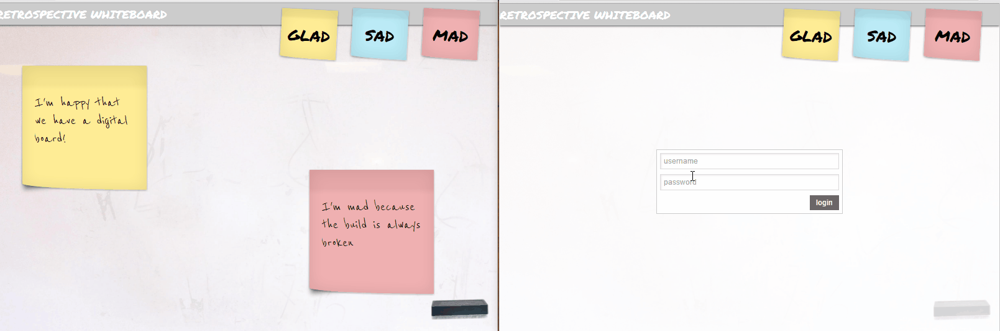

## A tutorial on how to create a retrospective board

With more and more teams working remote,, tools have started emerging to move processes online. But the fun part behind behind retrospectives, planning poker and other methods was always the interactivity, seeing cards move around and barely readable scribbles.

As such, let's take a look at how we can use data-sync to create a realtime retrospective board that supports both destops and mobile phones.



In the spirit of agile approaches, let us break down our requirements!

- add, edit and move around cards
- allow everyone with access to the board to see live updates
- have a mobile friendly interface

And to add a little bit of security incase you decide to make the application public, let's throw in a few security requirements:

- only let people access the board with a username and password
- only let cards be edited by their creator

To do this we'll be using good old jQuery on the frontend, and deepstream.io for data-sync

### Setting up a server

Installing deepstream is as simple as downloading the [latest version](https://github.com/deepstreamIO/deepstream.io/releases/latest) from github or installing it on linux via [apt](https://deepstream.io/inst
all/ubuntu/) or [yum](https://deepstream.io/install/centos/).

We also want to allow users to have a username and password to login, in order to get that we'll have to slightly modify the server configuration to authenticate users. Replace `auth: none` within your config file in place of `type: none`. This allows you to load your users from a username/password file.

```yaml
# reading users and passwords from a file
  type: file
  options:
    path: ./users.yml # Path to the user file. Can be json, js or yml
    hash: 'md5' # the name of a HMAC digest algorithm
    iterations: 100 # the number of times the algorithm should be applied
    keyLength: 32 # the length of the resulting key
```

You'll also find a default `users.yml` file where you can add your users and
also any user specific meta-data, in this case we'll define their roles

```json
john:
  password: "qQoEMakcnxfq6AQhQl2N9XiIke/JjTqDh+x7OMd5XQE=gEwXQZOWaHilsZ0fpllcOA=="
  data:
    role: developer
bob:
  password: "qQoEMakcnxfq6AQhQl2N9XiIke/JjTqDh+x7OMd5XQE=gEwXQZOWaHilsZ0fpllcOA=="
  data:
    role: scrum-master
```

Generating new password hashes can be done via:

```bash
deepstream hash cleartext-password
```

And finally just start the server via:

```bash
deepstream start
```

### Creating the board

##### Connecting to deepstream

Great, so now we have a server running lets look at setting up the board!

The first thing we'll need to do is let users login. To do this we'll need to get the deepstream client. You have a few different flavours of installation, either using [npm](), [bower]() or having it come as part of your [react]() or [polymer]() plugins. For this example we're going to go with the simplest approach of just fetching it directly from github.

```html
  <script
    type="text/javascript"
    src="https://rawgit.com/deepstreamIO/deepstream.io-client-js/master/dist/deepstream.min.js">
  </script>
```

Now that we have the deepstream library included we'll need to get it connect to the server.

```javascript
const client = deepstream( 'localhost:6020' );
```

##### Logging in

Since we want to limit users who can use the board we are going to have to get the username and password from a minimalistic login form:

```html
  <form action="#">
    <div class="login-error"></div>
    <input type="text" placeholder="username"/>
    <input type="password" placeholder="password"/>
    <input type="submit" value="login" />
  </form>
```

Which when the user submits gets you to login to the board:

```javascript
$( 'form' ).on( 'submit', function( event ){
  event.preventDefault();

  var authData = {
    username: $( 'form input[type="text"]' ).val(),
    password: $( 'form input[type="password"]' ).val()
  };

  ds.login( authData, function( success, loginData ) {
    if( success ) {
      var isDesktop = $( window ).width() > 800;
      new Board( ds, isDesktop );
      $( 'form' ).hide();
    } else {
      $( '.login-error' ).text( loginData ).show();
    }
  });
});
```
And that's part two, you now have your user connected and logged into deepstream!

##### The juicy parts

Now comes the fun part, getting all the cards to remain in sync across all browsers/phones. Let's take a step back and first look at data-sync and how it is used. We'll be using [records]() and [lists]() to keep state. A record is just a convienient way of storing and manipulating json with data-sync built in.

Core concepts:

* A record has a unique identifier, you can create your own or use `getUid()` to generate one for you

```javascript
const recordName = client.getUid();
const record = client.record.getRecord( recordName );
```

* You can set its data

```javascript
record.set( {
  owner: 'john'
  position: {
    left: 375,
    top: 250,
  },
  content: 'This card is awesome!',
  type: 'glad'
} )
```

* Get data

```javascript
console.log( record.get( 'position.left' ) ) // 250
```

* Subscribe to changes

```javascript
record.subscribe( 'position', ( newPosition ) = {
  console.log( 'Card moved!' )
} )
```

You also got a list, which is a useful way to maintain a set of records that have things in common. You can `addEntry( removeName )`, `removeEntry( recordName )` and listen to `entry-added` and `entry-removed` events.

Let's take a look at how we can put these things together to make a board. We'll need a list to contain the set of all the records on the board, and whenever a card is created add it into the dom. Since the list is the entry point to all our records we need to use a non-random name.

```javascript
// Creating a card
function createCard() {
  const cardId = 'postits/' + this.ds.getUid();
  const card = this.ds.record.getRecord( cardId );
  card.whenReady( ( record ) => {
    record.set( properties );
    this.cardList.addEntry( cardId );
  } );
}

// Adding a card to the dom
function onCardAdded() {
  new Card( /*...*/ );
}

// Creating all the existing cards on login
this.cardList = this.ds.record.getList( 'example-board' );
this.cardList.whenReady( ( this ) => {
  const entries = this.cardList.getEntries();
  entries.forEach( onCardAdded.bind( this ) );
} );

// Listening to card being added on the board.
Card```

That covers most of the creating part of the board, the demo code on [github]() fills in all the part I glossed over, such as removing cards and different ways you can add cards depending on your input devices.

The final requirement is dragging a card around and seeing it update on all other browsers. You can see this being done here:

```javascript
this.element
  .css( 'position', 'absolute' )
  .draggable( {
    handle: ".card-header",
    zIndex: 999,
    // Prevent jQuery draggable from updating the DOM's
    // position and leave it to the record instead.
    helper: function(){ return $( '<i></i>' ); },
    drag: ( event, ui ) => {
      this.record.set( 'position', {
        top: ui.position.top,
        left: ui.position.left
      } );
    }
  } );

this.record.subscribe( 'position', ( position ) => {
  if( position ) {
    this.element.css( {
      left: position.left,
      top: position.top
    } );
  }
}, true );
```

Note how we prevent jQuery to update the dom directly. This is because we are using using the record our single source of truth. By doing so our code will process things the same way regardless of whether the action happened remotely or locally. This is always a great way to consume changes, otherwise your code will become cluttered with unwanted conditions.

Great, so we now have a board! Let's look at adding a tiny bit of permissions now were are familiar with the cards json structure.

###### Permissions

Deepstream comes with a powerful permissioning language called **Valve**, which can be used to create rules to allow/deny all possible client actions.

Going back to our last requirement, we want to only allow the creator to update their own cards. Let's take a look at how we can implement that in our `pemission.yml` config file.

```yaml
record:
  "postits/.*":
    write: "data.owner === user.id"
```

And that's it, the only user who can edit their cards has to be the same as the cards creator.

Let's introduce a tiny bit of scope creep, and allow the `scrum-master` to edit any card, and be the only one who can delete cards. Luckily we added this earlier on in the user config so we have access to user roles.

```yaml
record:
  "postits/.*":
    write: "data.owner === user.id || user.id === 'scrum-master'"
    delete: "user.data.role === 'scrum-master'"
```

And done! We now have the brains and guts of a realtime, authenticated and permissioned retrospective board!